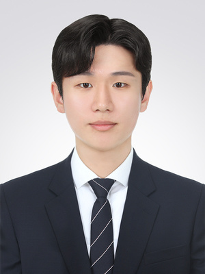
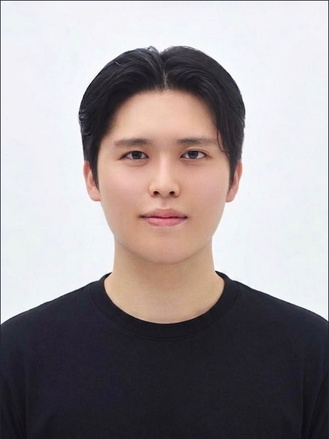

# 팀

광주 2반 6조 — github.com/peritago

<table>
<tr>
<td align="center"> <b>오영현</b></td>
<td align="center"> <b>강주현</b></td>
<td align="center"> <b>정웅기</b></td>
<td align="center"> <b>김영민</b></td>
<td align="center"> <b>김서현</b></td>
</tr>
<tr>
<td>PM Backend DevOps & Integration</td>
<td>Backend Data Architect API Architect</td>
<td>Backend Data Architect API Architect</td>
<td>Backend Data Architect API Architect</td>
<td>Frontend Product/UX Designer</td>
</tr>
</table>

> 팀별 1인이 여러 역할을 겸직했습니다. 백엔드는 도메인별로 완전히 독립 구현했습니다.
