<p align="center">
  
</p>

# peritago (페리타고)

> 사내 도메인 용어·은어를 **내 업무 언어로** 실시간 통역하는 서비스

## 목차

1. [프로젝트 소개](#1-프로젝트-소개)
2. [핵심 기능 흐름](#2-핵심-기능-흐름)
3. [아키텍처](#3-아키텍처)
4. [기술 스택](#4-기술-스택)
5. [주요 기능 목록](#5-주요-기능-목록)
6. [API 예시](#6-api-예시)
7. [실행 방법](#7-실행-방법)
8. [폴더 구조](#8-폴더-구조)
9. [화면 구성](#9-화면-구성)
- [추적성 (Traceability)](#추적성-traceability)
- [알려진 제약](#알려진-제약)
- [로드맵 및 한계](#로드맵-및-한계)
- [팀](#팀)

## 1. 프로젝트 소개

입사 3주차 신입은 회의 중 "그거 백프레셔 걸리는데요"라는 한마디에 흐름을 놓친다. 회의 흐름을 끊고 되묻기는 부담스럽고, 회의가 끝난 뒤 검색하면 이미 맥락은 사라져 있다. 타 부서로 이동한 경력직도 마찬가지다 — 자기 분야 용어는 익숙해도 옆 부서 은어 앞에서는 신입과 다를 게 없다.

peritago는 이 질의를 사내 근거(은어 사전 → 사내 위키)로 먼저 확인하고, **공식 정의**(원문 그대로)와 **개인화 설명**(질문자의 도메인 비유로 재구성) 두 파트로 답한다. 공식 정의는 절대 재작성하지 않고, 개인화 설명만 사용자가 이미 아는 분야에 빗대어 새로 만든다 — 그래야 "정확한 정의"와 "이해하기 쉬운 설명"이 서로를 오염시키지 않는다.

## 2. 핵심 기능 흐름

```
사용자 질의 (용어)
      │
      ▼
① 은어 사전 Exact Match (F-05)  ── DB 조회, AI 미사용
      │ 실패
      ▼
② 사내 위키 하이브리드 검색 (F-13)  ── 벡터(pgvector) + 키워드(pg_bigm), RRF로 병합
      │                              임베딩(text-embedding-3-small)에만 AI 사용
      │ 실패 (근거 없음)
      ▼
③ 2파트 응답 생성 (F-06, F-07)  ── gpt-4o-mini, 구조화 출력
      officialDefinition(공식 정의) + personalizedExplanation(개인화 설명)
```

- ①·②에서 근거를 찾으면 `sourceType = GLOSSARY | WIKI`, 둘 다 실패해도 오류가 아니라 `sourceType = GENERAL` + `outsideCompanyStandard = true`로 **200 정상 응답**한다. 이때 공식 정의는 반드시 고지 문구(`REQUIRED_PREFIX`, 예: "사내 위키와 은어 사전에 등록되어 있지 않습니다")로 시작한다.
- 대화 맥락 슬라이딩 윈도우(F-10)와 발화 중 은어 자동 감지(F-11)는 AI 없이 Redis + 규칙 기반으로 동작하는 보조 기능이다.
- 페르소나가 없는 사용자는 공식 정의만 받고, 개인화 파트는 페르소나 설정을 안내하는 문구로 대체된다.

## 3. 아키텍처

### 배포 구조
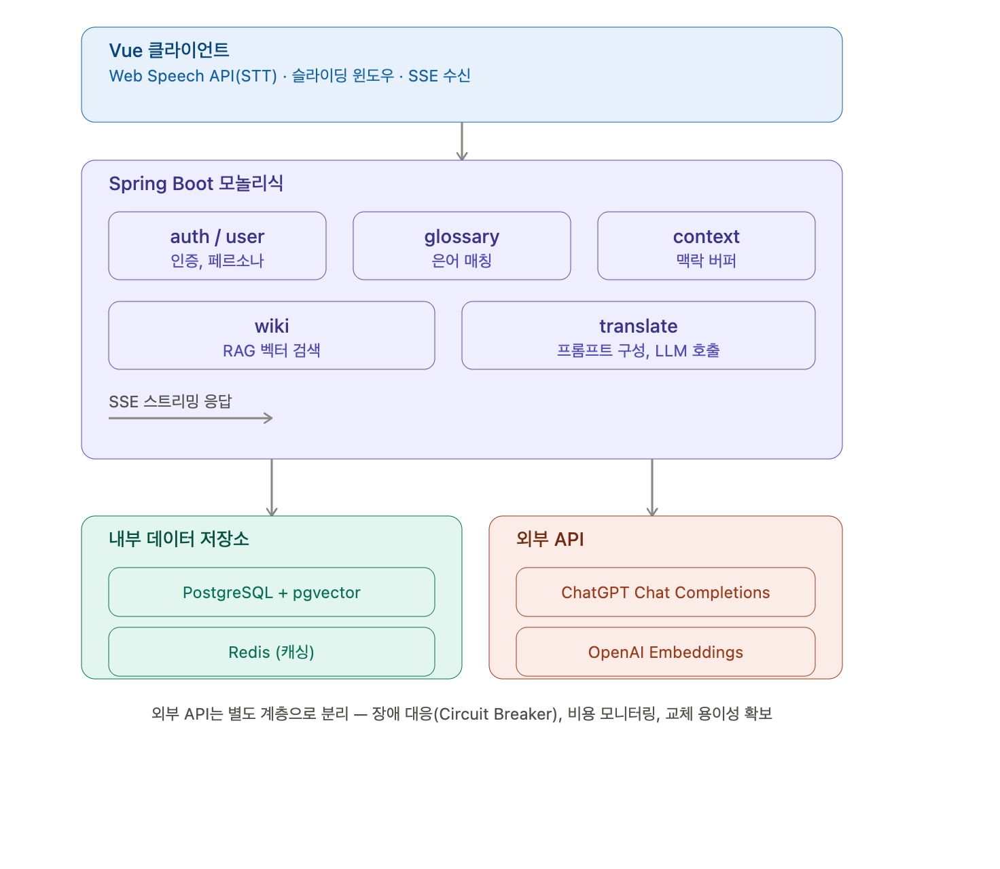

GitHub Repository에서 `git pull`한 뒤, 로컬 Docker Compose 안에 Client(Vue.js)·Backend(Spring Boot)·PostgreSQL(+pgvector)·Redis가 구성된다. 외부로는 Web Speech API(STT)와 OpenAI API만 호출한다.

### 인프라 아키텍처
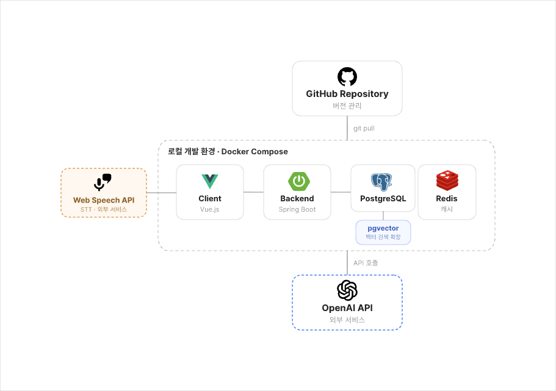

Vue 클라이언트(Web Speech API·슬라이딩 윈도우·SSE 수신)가 Spring Boot 모놀리식 내부의 `auth`/`user`(인증·페르소나), `glossary`(은어 매칭), `context`(맥락 버퍼), `wiki`(RAG 벡터 검색), `translate`(프롬프트 구성·LLM 호출) 도메인 패키지로 요청을 보내고, 내부 저장소(PostgreSQL+pgvector, Redis)와 외부 API(OpenAI Chat Completions, OpenAI Embeddings)를 각각 별도 계층으로 호출한다. 외부 API를 분리한 이유는 장애 대응(Circuit Breaker)·비용 모니터링·모델 교체 용이성 확보다. 실제 소스 구조는 [8. 폴더 구조](#8-폴더-구조) 참고.

### ERD
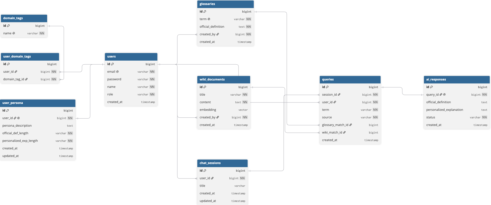

핵심 테이블(코드 기준, `users`/`chat_sessions`는 복수형·`query`/`ai_response`는 단수형 — [DBML 원본](광주_2반_6조_peritago-DB.dbml) 참고):

- `users` — 계정. `glossaries.created_by`, `wiki_documents.created_by`는 물리 FK 없이 `Long id`만 보관하는 논리 참조.
- `domain_tags` ↔ `user_domain_tags` — 도메인 태그 M:N. `user_persona`는 `user_id` UNIQUE로 1:1.
- `glossaries` — 은어 사전(F-05/F-09 근거). `wiki_documents` + `vector_store`(Spring AI가 자동 관리하는 pgvector 테이블) — 위키 RAG 근거(F-12/F-13).
- `chat_sessions` → `query`(1:N) → `ai_response`(1:1, `query_id` UNIQUE).

`query`에는 `term`/`context_snapshot`만 있고 근거 정보는 없다. **근거 매칭 결과(`source_type`, `source_ref`)와 생성 결과(`official_definition`, `personalized_explanation`, `model`, `prompt_version`, `token_usage`, `latency_ms`)는 모두 `ai_response` 쪽 컬럼**이다 — `query`가 `glossary_match_id`/`wiki_match_id`를 직접 갖는 구조가 아니다.

### 데이터 모델

**`query` ↔ `ai_response`가 1:1인 이유** — `ai_response.query_id`에 UNIQUE 제약을 걸어 질의당 응답 1건을 강제한다(`AiResponse.java`). LLM 생성이 실패하면 `TranslateService.generate()`가 던진 예외로 트랜잭션 전체가 롤백돼, 방금 저장한 `query`까지 함께 사라진다. 질의와 응답을 같은 트랜잭션에 묶어 "응답 없는 질의가 이력에 남는" 상태를 원천적으로 막는 설계다.

**`ai_response`의 관측성 컬럼 4종** — `model`, `prompt_version`, `token_usage`, `latency_ms`. "좋아 보인다"가 아니라 수치로 판단하기 위한 컬럼으로, 캐시 적중 시에는 `token_usage=0`으로 기록한다(`TranslationCache.find()`) — 원본 호출의 토큰 수를 그대로 남기면 비용 집계가 과대계상되기 때문이다. Mock 모드에서는 `model`이 `NULL`이다.

**Redis 키 / TTL**

| 키 패턴 | 타입 | TTL | 용도 |
|---|---|---|---|
| `context:{sessionId}` | LIST | 1시간(적재마다 갱신) | 대화 맥락 슬라이딩 윈도우, 최근 6문장(F-10) |
| `translate:{sha256}` | STRING | 1시간 | 무맥락 질의 응답 캐시(F-14). 키 해시에 용어+프롬프트 버전+페르소나 서술+응답 분량+비유 후보가 포함돼 눈높이가 다르면 캐시를 공유하지 않는다 |
| `refresh:{userId}` | STRING | 14일 | 리프레시 토큰 저장 |
| `blacklist:{accessToken}` | STRING | 액세스 토큰 잔여 유효시간까지 | 로그아웃된 액세스 토큰 무효화 |

### 유스케이스 다이어그램
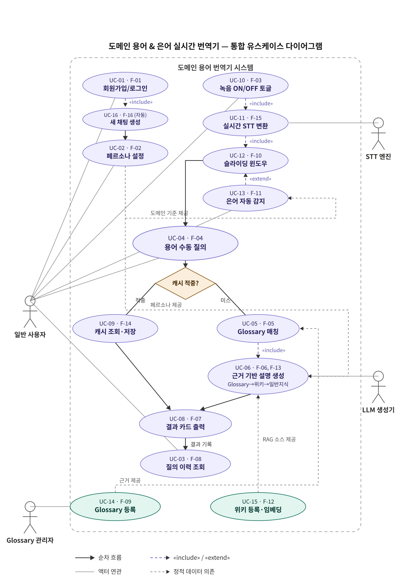

액터는 일반 사용자·Glossary/Wiki 관리자·STT 엔진·LLM 생성기다. 회원가입/로그인(UC-01)→페르소나 설정(UC-02) 이후 핵심 흐름은 용어 수동 질의(UC-04) 또는 실시간 STT(UC-11)+은어 자동 감지(UC-13)로 진입해, 캐시 적중 여부(UC-09)에 따라 캐시 조회 또는 Glossary 매칭(UC-05)→근거 기반 설명 생성(UC-06, Glossary→위키→일반지식 순 폴백)→결과 카드 출력(UC-08)→질의 이력 조회(UC-03)로 이어진다. 관리자 전용으로 Glossary 등록(UC-14), 위키 등록·임베딩(UC-15)이 있다.

### 시퀀스 다이어그램
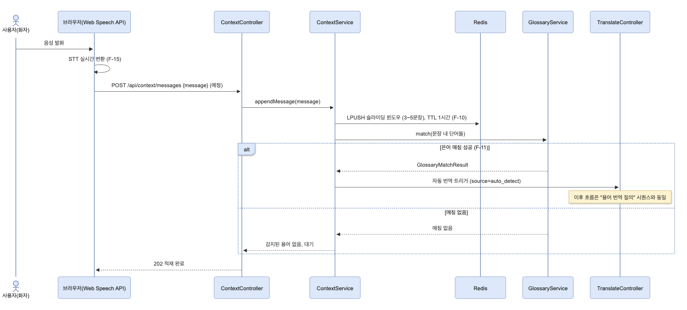

`POST /api/translate` 처리 순서(`TranslateService.translate()` 기준):

1. `TranslateController` — JWT에서 `userId` 추출, 요청 검증
2. `TranslateService` — 세션 소유자 확인(`findByIdAndUserId`, 타인 세션 접근 차단) → `Query` 저장 → `ContextService.snapshot()`으로 맥락 조회
3. `PersonaService.findPersona()` — 페르소나 미존재 시 이후 개인화 파트는 안내 문구로 대체됨을 표시
4. `GlossaryMatcher.match()` — Exact Match 시도 (F-05)
5. 미매치 시 `WikiEvidenceFinder.find()` → `WikiService`(벡터+키워드 RRF 하이브리드 검색) → `AnalogySearchService`(사용자 도메인 비유용 구조 요약, LLM 1회) (F-13)
6. 맥락 없는 질의는 `TranslationCache`에서 캐시 조회 (F-14) — 적중 시 6→8 생략
7. 미적중 시 `TranslationGenerator.generate()` → OpenAI Chat Completions(`gpt-4o-mini`, 구조화 출력) 호출 (F-06)
8. `AiResponse` 저장(같은 트랜잭션 — LLM 호출 실패 시 `Query`까지 롤백) → 캐시 저장
9. `TranslateResponseDto`로 조립해 클라이언트에 반환

### 교차 도메인 번역 (HyDE)

개인화 설명의 비유 근거는 `AnalogySearchService.search()`가 3단계로 찾는다(`AnalogySearchService.java`).

1. **① Wiki 1차 검색** — 질의 용어(예: "포토공정")를 산업 필터 없이 전체 문서 대상으로 검색해 근거를 그라운딩한다. 산업으로 미리 좁히지 않는 이유는 translate가 질문이 어느 산업 얘기인지 아직 모르기 때문이다(그게 애초에 질문의 일부).
2. **② LLM 구조 서술 생성(HyDE)** — 1차 근거의 "구조적 특징"(몇 단계인지, 단계 간 의존 관계, 순차/병렬/반복 여부)만 한두 문장으로 요약한다. 프롬프트에 "없는 사실을 추가하지 말 것"을 명시해 원문에 없는 내용을 새로 만들지 않게 한다. 원본 질의어를 그대로 재사용하지 않는 이유는, 예를 들어 "포토공정"을 "개발" 산업으로 그대로 검색하면 주제가 달라 거의 걸리지 않기 때문 — 대신 구조 요약문을 질의어로 써서 사용자 도메인에서 "구조가 비슷한" 문서를 찾는다.
3. **③ Wiki 2차 검색** — ②의 요약문으로 사용자의 도메인(`userIndustry`)만 벡터 전용 검색한다. 키워드(pg_bigm) leg를 빼는 이유는 구조 서술이 "순서"·"단계"처럼 흔한 단어라 키워드로 태우면 무관한 문서가 새어 들어오기 때문(실측 확인).

**억지 비유 방지 안전장치**

- 1차 근거가 없으면 ②를 호출하지 않는다 — 요약할 대상 자체가 없는데 LLM을 부르면 비용/지연만 든다.
- 사용자 도메인(페르소나)이 없으면 비유 검색 자체를 건너뛴다 — 비유를 만들 기준이 없다(`WikiEvidenceFinder.findWithoutAnalogy()`).
- 2차 검색 결과가 1차와 같은 문서면 후보에서 제외한다(`selectAnalogies()`) — 사용자 도메인이 그 용어의 출신 도메인과 같으면 "MSA를 MSA로 설명하는" 순환이 되기 때문.
- 그 도메인에 맞는 비유가 준비돼 있지 않으면 억지로 만들지 않고 빈 리스트를 반환한다(Mock 데이터 주석에도 명시된 원칙).

## 4. 기술 스택

**백엔드**
- Java 21, Spring Boot 4.1.1 (Gradle)
- Spring Security + JWT(`jjwt`) — 액세스/리프레시 토큰, 재발급, 로그아웃 블랙리스트
- Spring Data JPA + PostgreSQL(pgvector, pg_bigm 커스텀 이미지)
- Spring Data Redis — 대화 맥락 슬라이딩 윈도우, 무맥락 질의 응답 캐시
- Spring AI(`spring-ai-starter-model-openai`, `spring-ai-starter-vector-store-pgvector`) — 위키 RAG, LLM 생성
- OpenAI `gpt-4o-mini`(2파트 생성), `text-embedding-3-small`(위키 임베딩)

**프론트엔드**
- Vue 3(`<script setup>`) + Vite, Pinia, Vue Router
- fetch 기반 커스텀 API 클라이언트 — 401 시 리프레시 후 재시도
- STT는 브라우저 Web Speech API 기본 폴백

## 5. 주요 기능 목록

기능 ID는 코드 주석/커밋 메시지(`F-04` 등 2자리 표기)와 [DBML 설계 문서](광주_2반_6조_peritago-DB.dbml)(`REQ-F-0##` 3자리 표기)에서 확인한 값이다. 두 표기는 같은 기능을 가리킨다.

**회원 / 페르소나**
- F-01 회원가입 · 로그인 · 토큰 재발급 · 로그아웃 (`AuthController`, `UserController`)
- F-02 도메인 페르소나 설정 — 도메인 태그, 업무 배경, 응답 분량 (`/api/users/me/persona`)
- F-03 채팅 세션 생성/목록/제목 수정 (`ChatSessionController`)

**번역 핵심**
- F-04 용어 번역 질의 (`POST /api/translate`)
- F-05 은어 사전 Exact Match
- F-06 공식 정의 / 개인화 설명 2파트 생성 (LLM)
- F-07 사내 근거 없음(GENERAL) 고지 — `outsideCompanyStandard`
- F-08 질의 이력 조회 (페이징)
- F-09 은어 사전 등록/조회 (`/api/glossary/admin`, ADMIN 전용)
- F-14 무맥락 질의 응답 캐시 (Redis, TTL 1시간)

**맥락 / STT / 위키 / 관리자**
- F-10 대화 맥락 슬라이딩 윈도우 (Redis LIST, 최근 5~6문장)
- F-11 발화 중 사내 은어 자동 감지
- F-12 위키 문서 등록/삭제 및 벡터 인덱싱 (`/api/wiki/admin`, ADMIN 전용)
- F-13 위키 하이브리드 검색(RAG) — 은어 사전 매치 실패 시 폴백 (`/api/wiki/search`는 로그인 사용자면 조회 가능, ADMIN 전용 아님)
- STT 확정 문장 적재 (프론트 Web Speech API 폴백, 코드 주석 표기는 F-15)

## 6. API 예시

```
POST /api/translate
Request:  { "sessionId": 12, "term": "백프레셔" }
```

```json
{
  "status": 200,
  "message": "SUCCESS",
  "data": {
    "queryId": 31,
    "sessionId": 12,
    "term": "백프레셔",
    "officialDefinition": "...",
    "personalizedExplanation": "...",
    "sourceType": "GLOSSARY",
    "sourceRef": "7",
    "outsideCompanyStandard": false,
    "createdAt": "2026-09-03T14:02:11"
  }
}
```

실패(LLM 생성 오류, 503):
```json
{ "status": 503, "message": "TRANSLATION_FAILED", "data": null }
```

모든 응답은 `{ status, message, data }` 공통 봉투를 쓰며, 인증이 필요한 요청은 `Authorization: Bearer {accessToken}`을 붙인다.

## 7. 실행 방법

### 7-1. 인프라 (Postgres + Redis)

```bash
docker-compose up -d
```

`docker-compose.yml`은 `./docker/postgres-pgbigm`(pgvector + pg_bigm 커스텀 이미지, `postgres:5432`)와 `redis:7-alpine`(`6379`)을 띄운다.

### 7-2. 백엔드

```bash
cd backend
./gradlew bootRun
```

`backend/.env`가 없거나 비어 있으면 **Mock 모드**로 자동 기동한다(OpenAI 호출 0건). 기동 시 `data.sql`이 데모 계정(`admin@domainbridge.dev` / `demo@domainbridge.dev`)을 자동 생성하며, `demo` 계정으로 "MSA"를 질의하면 코드에 내장된 위키 목 데이터로 `sourceType=WIKI` 응답을 바로 확인할 수 있다.

| 스위치 | 기본값 | 의미 |
|---|---|---|
| `peritago.translate.mock.wiki` | `true` | 위키 검색을 `WikiEvidenceFinder`의 고정 데이터로 대체 |
| `peritago.translate.mock.generator` | `true` | 2파트 응답을 규칙 기반(`MockTranslationGenerator`)으로 조합 |

**실 OpenAI 연동 모드**로 돌리려면 `backend/.env`에 아래를 추가한다(`.env`는 커밋되지 않음):

```
OPENAI_API_KEY=sk-...
peritago.translate.mock.wiki=false
peritago.translate.mock.generator=false
```

실 모드에서는 Mock 데이터가 쓰이지 않으므로, admin 계정으로 `POST /api/wiki/admin`을 호출해 위키 문서를 최소 1건 등록해야 근거가 잡힌다(등록 1건 = 임베딩 1회 호출).

백엔드는 `localhost:8080`에서 뜨고, `spring.datasource`/`spring.data.redis` 기본값은 위 docker-compose의 postgres(`5432`)·redis(`6379`)를 그대로 쓴다. JPA는 `ddl-auto: update`로 스키마를 직접 생성/갱신하며, `spring.sql.init.mode: always` + `defer-datasource-initialization: true`로 스키마 생성 후 `data.sql` 시드가 항상 실행된다(별도 마이그레이션 도구 없음).

### 7-3. 프론트엔드

```bash
cd frontend
npm install
npm run dev
```

`http://localhost:5173`에서 접속하며, `/api`·`/ws` 요청은 Vite 프록시가 `VITE_BACKEND_ORIGIN`(기본 `http://localhost:8080`)으로 넘긴다.

### 7-4. 동작 확인

```bash
./scripts/smoke-test.sh
```

회원가입 → 로그인 → 페르소나 설정 → 세션 생성 → 용어 질의 → 이력 조회 → 관리자 은어 등록까지 curl로 검증한다(`jq` 필요).

## 8. 폴더 구조

```
peritago/
├── README.md
├── docker-compose.yml                     # 로컬 postgres(pgvector+pg_bigm) + redis
├── docker/postgres-pgbigm/Dockerfile
├── docs/screenshots/                      # 화면 캡처 6장 + 아키텍처 다이어그램 5장 + 로고 + 팀 사진 5장(CONTRIBUTORS.md용)
├── scripts/smoke-test.sh                  # API 스모크 테스트
├── 광주_2반_6조_peritago-DB.dbml           # ERD (DBML)
│
├── backend/                               # Spring Boot (Java 21, Gradle)
│   ├── build.gradle / settings.gradle / gradlew
│   └── src/
│       ├── main/resources/                # application.yml, data.sql, wiki-db-setup.sql
│       ├── main/java/com/skala/domainbridge/
│       │   ├── DomainbridgeApplication.java
│       │   ├── auth/          # 로그인·JWT 발급/재발급·필터
│       │   │   ├── controller/  AuthController
│       │   │   ├── jwt/         JwtAuthenticationFilter · JwtTokenProvider · TokenService
│       │   │   ├── service/     AuthService
│       │   │   └── dto/request,response
│       │   ├── user/          # 회원가입·페르소나·도메인 태그
│       │   │   ├── controller/  UserController · DomainTagController
│       │   │   ├── entity/      User · UserPersona · DomainTag · UserDomainTag · Role · ExplanationLength
│       │   │   ├── repository/  UserRepository 외 3개
│       │   │   ├── service/     UserService · PersonaService
│       │   │   └── dto/request,response
│       │   ├── glossary/      # 은어 사전 CRUD + 매칭
│       │   │   ├── controller/  GlossaryController
│       │   │   ├── entity/      Glossary
│       │   │   ├── repository/  GlossaryRepository
│       │   │   ├── service/     GlossaryService · GlossaryMatcher · GlossaryMatchResult
│       │   │   └── dto/request,response
│       │   ├── translate/     # 세션·질의·2파트 응답 (핵심 흐름)
│       │   │   ├── controller/  ChatSessionController · TranslateController
│       │   │   ├── entity/      ChatSession · Query · AiResponse · SourceType
│       │   │   ├── port/        TranslationGenerator (mock / openai 구현체)
│       │   │   ├── repository/  3개
│       │   │   ├── service/     ChatSessionService · TranslateService
│       │   │   ├── wiki/        WikiEvidenceFinder
│       │   │   └── cache/       TranslationCache
│       │   ├── context/       # STT 맥락 슬라이딩 윈도우 + 은어 자동 감지(F-11)
│       │   │   ├── controller/  ContextController
│       │   │   └── service/     ContextService · SlangDetector
│       │   ├── wiki/          # 사내 위키 RAG (pgvector)
│       │   │   ├── controller/  WikiController
│       │   │   ├── entity/      WikiDocument
│       │   │   ├── repository/  VectorStoreKeywordSearchRepository 외
│       │   │   └── service/     WikiService · AnalogySearchService
│       │   └── common/        # 전역 설정·예외·응답 포맷
│       │       ├── config/      SecurityConfig · RedisConfig · JpaAuditingConfig
│       │       ├── entity/      BaseEntity
│       │       ├── exception/   CustomException · ErrorCode · GlobalExceptionHandler
│       │       └── response/    ApiResponse
│       └── test/java/com/skala/domainbridge/   # 도메인별 단위 테스트
│
└── frontend/                               # Vue 3 + Vite
    ├── index.html / vite.config.js / package.json
    ├── public/assets/                      # 로고 이미지
    └── src/
        ├── main.js / App.vue
        ├── router/index.js                 # 인증·페르소나·관리자 가드
        ├── api/          http.js(공용 클라이언트) · translate.js(SSE)
        ├── stores/       auth · persona · chat · stt · glossary (Pinia)
        ├── views/        LoginView · SignupView · PersonaSetupView · TranslateHomeView · MyGlossaryView · StubView
        ├── components/   AppHeader · ChatSidebar · SttConsole/Rail · RecordingStatusPanel · WaveformMeter · ResultCard/Row · EvidenceBadge · DomainTag · 모달류
        ├── composables/  useMicMeter · sttSources
        └── styles/       tokens.css(디자인 토큰) · base.css
```

## 9. 화면 구성

로그인 → 회원가입 → 페르소나 설정 → 메인 화면 → 질의 결과 → 나의 용어집 순서로 캡처했다(`docs/screenshots/`).

| 화면 | 설명 |
|---|---|
| 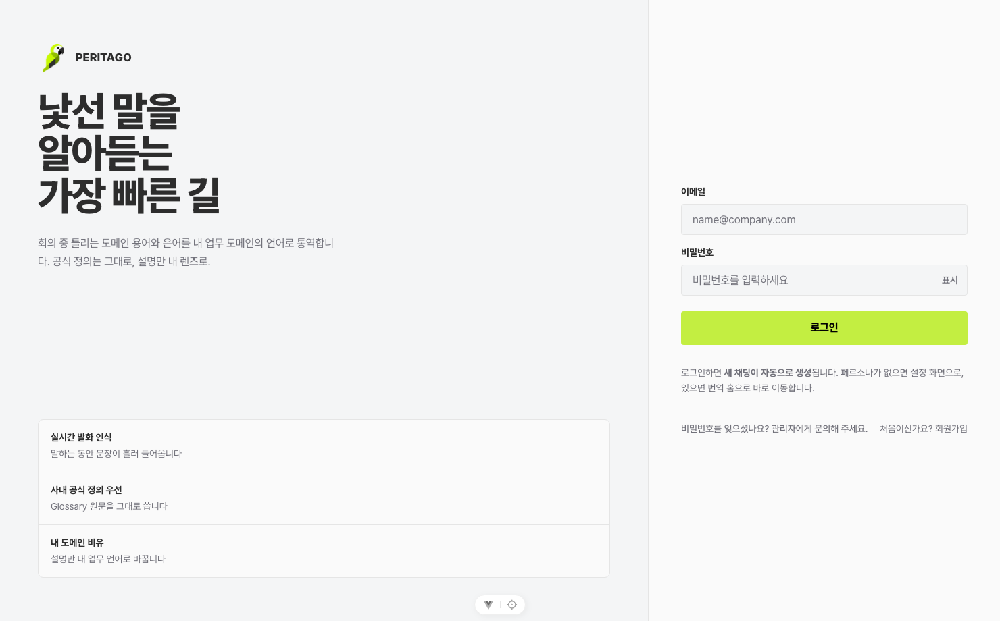 | 로그인 |
| 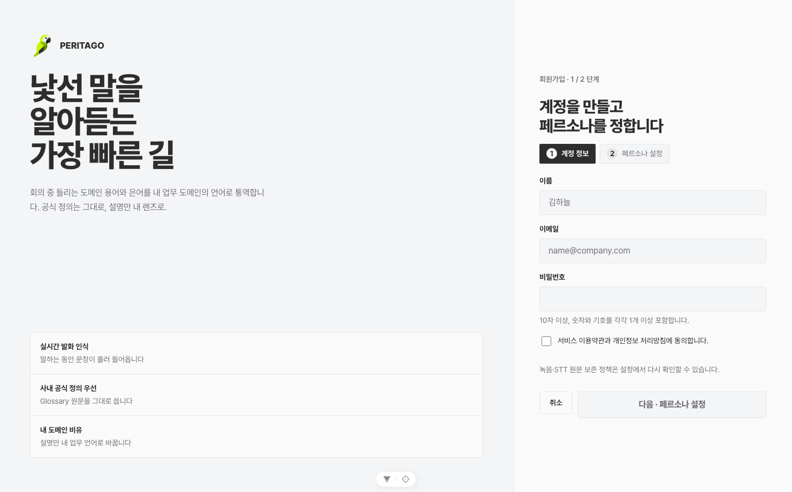 | 회원가입 |
| 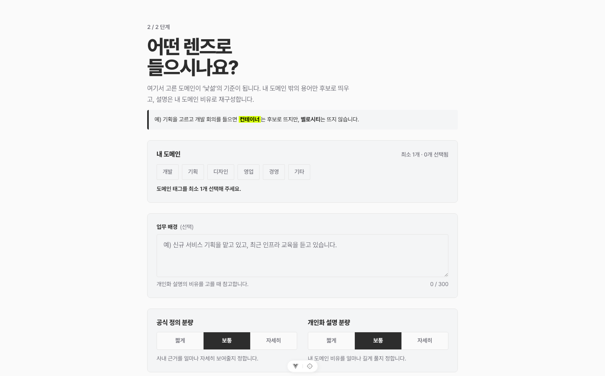 | 도메인 태그·업무 배경·응답 분량 설정 |
| 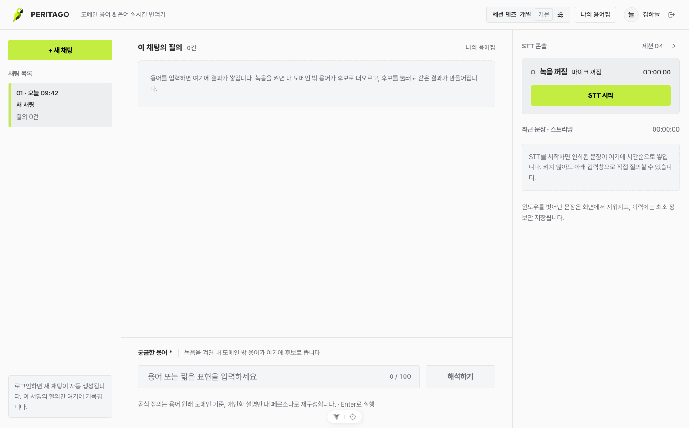 | 질의 이력 + STT 콘솔 (3단 레이아웃) |
| 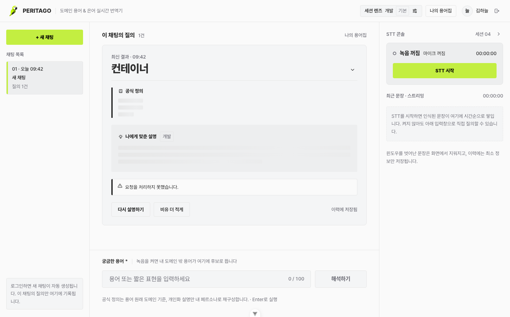 | 근거 뱃지 + 공식 정의 + 개인화 설명 |
| 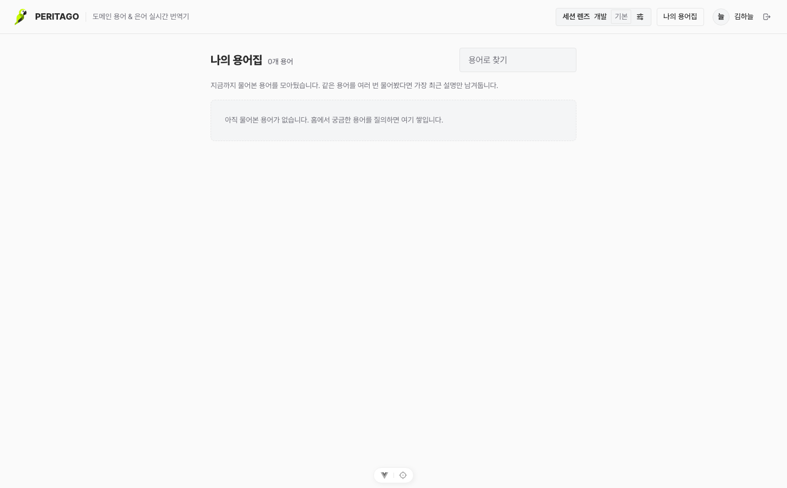 | 지금까지 질의한 용어 모음 |

와이어프레임/설계 산출물은 별도 설계 문서를 참고한다.

## 추적성 (Traceability)

요구사항(`REQ-F-###`, [DBML](광주_2반_6조_peritago-DB.dbml) 주석)과 커밋의 기능 ID(`F-##`)가 코드 레벨에서 서로 연결된다 — 예: [`a807e00`](https://github.com/peritago/peritago/commit/a807e00) `feat(context): 대화에서 사내 은어 자동 감지 (F-11)`, [`4e4850f`](https://github.com/peritago/peritago/commit/4e4850f) `feat(translate): 위키 근거 연동과 교차 도메인 비유 (F-13)`. `git log --grep="F-11"` 등으로 특정 기능 ID가 어느 커밋에서 구현됐는지 바로 추적할 수 있다.

화면(`SCR-###`)·유스케이스(`UC#`) 단위 추적성 매트릭스는 이 저장소에는 없고 별도 설계 문서에서 관리된다. 최신 상태는 그쪽을 확인해야 한다.

## 알려진 제약

- 회원가입으로 만든 계정은 항상 `ROLE.USER`다. 관리자 기능을 테스트하려면 DB에서 직접 `role`을 `ADMIN`으로 바꾼 뒤 재로그인해야 한다(JWT의 role 클레임은 로그인 시점에 고정).
- `POST /api/users`, `POST /api/sessions`는 응답 JSON엔 `"status":201`로 적히지만 실제 HTTP 상태 코드는 200이다(`@ResponseStatus` 미지정).
- STT는 브라우저 Web Speech API가 기본 폴백이며, 별도 STT 서버 소켓 URL을 `.env`에 넣으면 그쪽으로 붙는다.

전체 ERD는 [`광주_2반_6조_peritago-DB.dbml`](광주_2반_6조_peritago-DB.dbml)에 있다 — [dbdiagram.io](https://dbdiagram.io)에 붙여 넣으면 바로 그려진다.

## 로드맵 및 한계

**이번 스프린트에서 확인한 것**
- 근거(Glossary → Wiki → General) 3단계 폴백으로 "모르면 모른다"고 답하는 신뢰 가능한 응답 설계
- 도메인별 완전 독립 구현 구조([8. 폴더 구조](#8-폴더-구조) 참고) 덕분에 5인이 병렬로 개발 가능함을 확인

**향후 계획**
- 위키 하이브리드 검색 정확도 고도화 (RRF 가중치 튜닝, 임베딩 모델 재평가)
- 다국어 지원으로 확장 (영문 사내 문서·용어 대응)
- Mock ↔ 실제 LLM ↔ 사내 sLLM 간 손쉬운 전환 (현재 `TranslationGenerator` 인터페이스로 이미 확보된 기반 — `port/mock`, `port/openai` 구현체 분리)

**아쉬운 점**
- STT 자동 감지(F-11)의 완성도 — `SlangDetector`가 은어 사전과의 문자열 대조(정규식 단어 경계 매칭)로만 동작해 은어 변형·오탈자에 취약함

## 팀

팀 소개는 [CONTRIBUTORS.md](CONTRIBUTORS.md) 참고.
